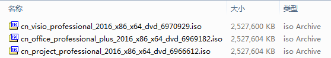

# Office-Visio-Project多合一程序

## 程序功能

本程序实现只下载`Office`、`Project`、或者`Visio`中的任意一个安装包，再拷贝我从其余两个安装包中提取出的差异文件（仅`setup32.exe`和`setup64.exe`两个`exe`，加起来不到7M），实现原程序和另外两个程序的安装。

## 缘起

由于电脑一直没有安装`Project`，领导发过来一个执行计划，发现打不开，于是上[I Tell You](https://msdn.itellyou.cn/)下载`Project 2016`，安装的时候提示我安装了32位版的`Office`，`Office`到底安装的是32位还是64位鬼还知道，于是卸载`Office`，同时去下载64位版的回来。

两个文件下下来后摆在一起一看，它喵的`Office`和`Project`大小一毛一样，这就不得不让我怀疑`Project`是不是和`Office`就是安装配置文件不一样，其实数据文件没啥鸟区别，为了证实我的猜测，我又去下载了`Visio`，一看文件大小，仅仅小了4KB。



我也懒得一个文件一个文件去对比哈希值了，直接`git`对比差异，果然`ISO`解压后仅仅只有`office`目录下的`setup32.exe`和`setup64.exe`不一样，其他数据文件一毛一样。

## 使用方式

> Office
> ```
> ed2k://|file|cn_office_professional_plus_2016_x86_x64_dvd_6969182.iso|2588266496|27EEA4FE4BB13CD0ECCDFC24167F9E01|/
> ```

> Project
>
> ```
> ed2k://|file|cn_project_professional_2016_x86_x64_dvd_6966612.iso|2588266496|DEF65A0A9B12D8A8B734528800F625D5|/
> ```

> Visio
>
> ```
> ed2k://|file|cn_visio_professional_2016_x86_x64_dvd_6970929.iso|2588262400|52A997F3AF4E40B896C8E4677CF10E90|/
> ```

1、下载以上任意一个官方安装包解压到目录`A`，运行`A`目录下的`setup.exe`进行安装；

2、拷贝本项目`Office`、`Project`、或者`Visio`目录下的`setup32.exe`和`setup64.exe`，覆盖`A`目录下`office`目录中的同名文件；

3、再次运行`A`目录下的`setup.exe`安装`Office`、`Project`、或者`Visio`，官方原版安装包下载任意一个即可。

我仅在Office 2016专业增强版、Project 2016专业版和Visio 2016专业版上进行以上测试，其他版本之间没有做相关实验。

## 哈希值

### 主安装程序

```
文件: D:\SOFT\cn_office_professional_plus_2016_x86_x64_dvd_6969182.iso
大小: 2588266496 字节
修改时间: 2018年4月25日, 13:09:55
MD5: 96B5F9934FF532F51495F1D7FC587168
SHA1: 277926A41B472EE38CA0B36ED8F2696356DCC98F
CRC32: 7D4B565E

文件: D:\SOFT\cn_project_professional_2016_x86_x64_dvd_6966612.iso
大小: 2588266496 字节
修改时间: 2018年4月25日, 12:04:04
MD5: 98DEBEB780C45069C5370718447637CF
SHA1: 245787253622D4D790F62012B578398EA78D8EA2
CRC32: 728C081A

文件: D:\SOFT\cn_visio_professional_2016_x86_x64_dvd_6970929.iso
大小: 2588262400 字节
修改时间: 2018年4月25日, 15:34:08
MD5: 16E516B37CC58C039DB3FA27D388417D
SHA1: E16292B938A284E14A79E4998209F5A4143DBF8A
CRC32: E2489A4E
```

### 差异文件

#### Office

提取自`cn_office_professional_plus_2016_x86_x64_dvd_6969182.iso`解压后的`office`目录下：

```
文件: D:\SOFT\Office-Visio-Project-In-One\Office\office\setup32.exe
大小: 2875968 字节
文件版本: 16.0.4266.1003
修改时间: 2015年8月17日, 0:02:08
MD5: 89873AD64993569524A12AFD958B55E1
SHA1: A17C05BB182B27330824D64E5C1EADE37539E320
CRC32: 504F488C

文件: D:\SOFT\Office-Visio-Project-In-One\Office\office\setup64.exe
大小: 4282432 字节
文件版本: 16.0.4266.1003
修改时间: 2015年8月17日, 0:08:56
MD5: 6A47295487179872E83C9205309621BF
SHA1: ABB7263CBC8F52E989DCD27FAEC480017408EDA7
CRC32: 24B056F5

```

#### Project

提取自`cn_project_professional_2016_x86_x64_dvd_6966612.iso`解压后的`office`目录下：

```
文件: D:\SOFT\Office-Visio-Project-In-One\Project\office\setup32.exe
大小: 2875968 字节
文件版本: 16.0.4266.1003
修改时间: 2015年8月17日, 0:02:14
MD5: 0661E3F488D3CF627DD81B98FFCADEDB
SHA1: F98A666975BD0F6B44F3A847FD31EC7F9D7904E3
CRC32: F6500F86

文件: D:\SOFT\Office-Visio-Project-In-One\Project\office\setup64.exe
大小: 4282432 字节
文件版本: 16.0.4266.1003
修改时间: 2015年8月17日, 0:08:53
MD5: 2493D3C98F743B35DB701649D0639F44
SHA1: 88DDF1863DDE00AE115D9BF8386BE13CECEE7DA7
CRC32: BFC77F59
```

#### Visio

提取自`cn_visio_professional_2016_x86_x64_dvd_6970929.iso`解压后的`office`目录下：

```
文件: D:\SOFT\Office-Visio-Project-In-One\Visio\office\setup32.exe
大小: 2874536 字节
文件版本: 16.0.4266.1003
修改时间: 2015年8月17日, 0:02:18
MD5: A77F767BE5612CA9D5E9B9A63A0BC66E
SHA1: 649EC0FCFDA6290E87993CCE586043FF04CB1CB9
CRC32: 8DCFDF18

文件: D:\SOFT\Office-Visio-Project-In-One\Visio\office\setup64.exe
大小: 4281000 字节
文件版本: 16.0.4266.1003
修改时间: 2015年8月17日, 0:09:05
MD5: D9B25FCCD58E49DEAE74DB76F7481B82
SHA1: 5B13B0947EE50FF93DC426A420928E2CB8EBC450
CRC32: 6E13EE13
```

## 结语

以上只是我的猜测，因为我是在三个程序都安装完毕后才做的`git`对比，值得惊喜的是公司过两个星期要给我换电脑了，终于要上`SSD`了（笔者的笔记本三年前就上了），到时候再亲自实践吧。